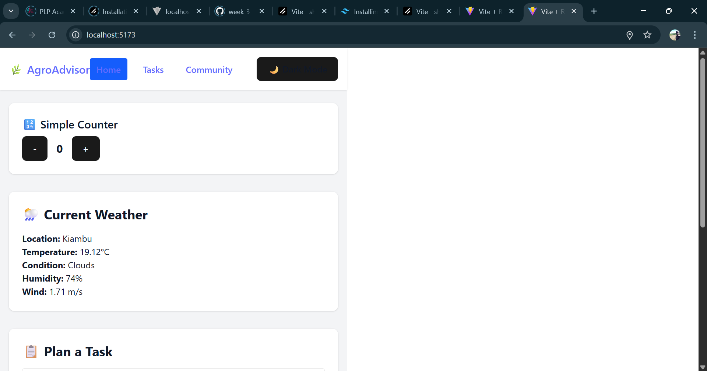
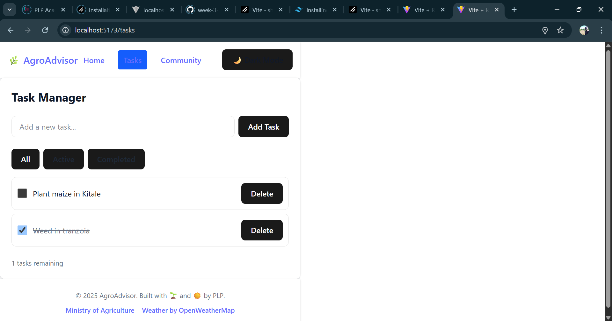
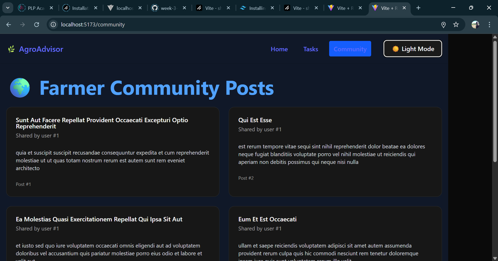

```markdown
# 🌾 Agro Task Advisor

Agro Task Advisor is a responsive, weather-aware task planning app built for farmers and agri-enthusiasts in mind. It combines real-time weather data with a simple task manager and a collaborative community space—helping users make informed decisions tailored to local conditions.

[🌐 Live Demo](https://agro-task-advisor.onrender.com)

---

## 🖼️ Screenshots

### 🌤️ Weather Dashboard & Task Planner
 
- Live weather updates for Kiambu (OpenWeatherMap)
- Task creation interface tied to local conditions
- Clean, responsive layout with dark mode support

---

### ➕ Counter Component (Task Progress Tracker)
 
- Interactive counter used as task quantifier or test feature
- Lightweight component with UI consistency
- Useful for future expansion (e.g., tracking recurring tasks)

---

### 🗣️ Community Post Section

- Reframed placeholder data into real farmer-style discussions
- Styled post cards with semantic structure
- Optimized for readability and mobile responsiveness


---

## ✨ Features

- 🔍 **Live Weather Data**: Fetched from OpenWeatherMap and presented with clear visuals
- 📆 **Task Planner**: Create tasks with optional weather awareness
- 👥 **Community Feed**: Reimagined placeholder content as farmer discussions
- 🌗 **Dark Mode**: Toggleable and persists in localStorage
- ⚡ **PNPM & Vite Build**: Lightning-fast development and deploy pipeline

---

## 🛠 Tech Stack

| Category           | Tools Used                                  |
|-------------------|----------------------------------------------|
| Frontend          | React, Tailwind CSS, Vite                   |
| Package Manager   | pnpm                                         |
| Weather Data      | OpenWeatherMap API                          |
| Posts (Placeholder) | JSONPlaceholder API                        |
| Deployment        | Render                                       |
| State/Logic       | useState, useEffect, custom hooks           |
| Extras            | Dark mode toggle, modular architecture      |

---

## 📦 Getting Started

### 1. Clone the repo
```bash
git clone https://github.com/PLP-MERN-Stack-Development/week-3-react-js-assignment-HopefulJim7.git
cd week-3-react-js-assignment-HopefulJim7/TaskManager
```

### 2. Install dependencies
```bash
pnpm install
```

### 3. Add environment variables

Create a `.env` file in `TaskManager/`:

```env
VITE_WEATHER_API_KEY=your_openweather_api_key
VITE_BASE_URL=https://jsonplaceholder.typicode.com
```

### 4. Run the dev server
```bash
pnpm run dev
```

---

## 🚀 Build & Deploy

To create a production build:

```bash
pnpm run build
```

The output will be in the `dist/` folder. Deploy that folder to your favorite host (e.g. Render, Netlify, Vercel).

---

## 🧠 Developer Notes

- Environment variables must be prefixed with `VITE_` to be recognized by Vite
- Safe defaults are applied when variables are missing
- Task and post data can be easily swapped with real endpoints later
- Designed with modularity and scalability in mind

---

## 📘 Learning Goals

This project was part of a MERN Stack training module, emphasizing:

- Practical use of APIs
- Scalable frontend architecture
- Clean state management with React hooks
- Accessible, responsive design with Tailwind CSS
- Deployment pipelines with environment isolation

---

## 🪪 License

© 2025 Jim Hope  
Licensed under the [MIT License](./LICENSE).

---
